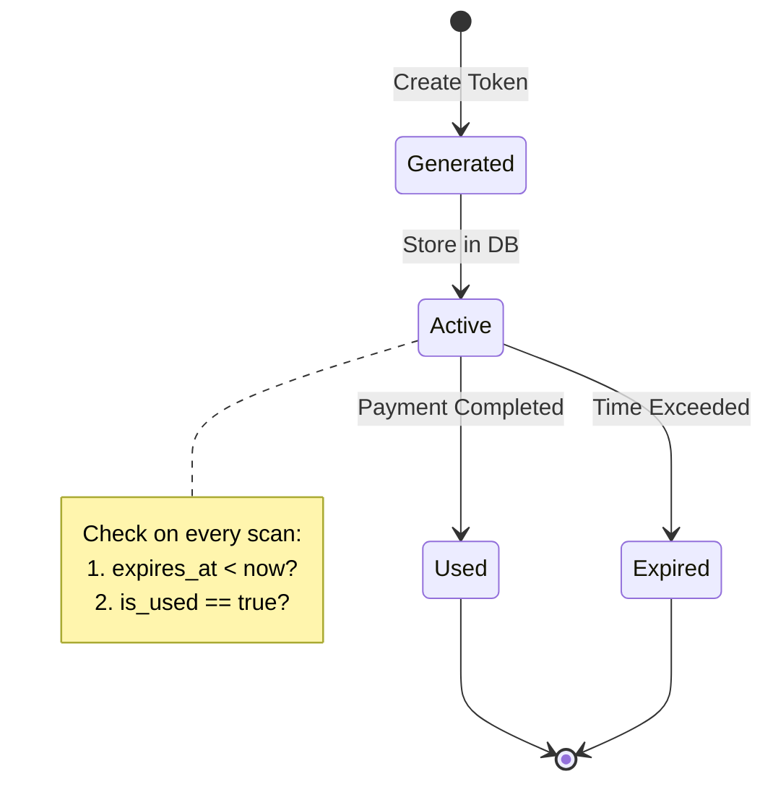
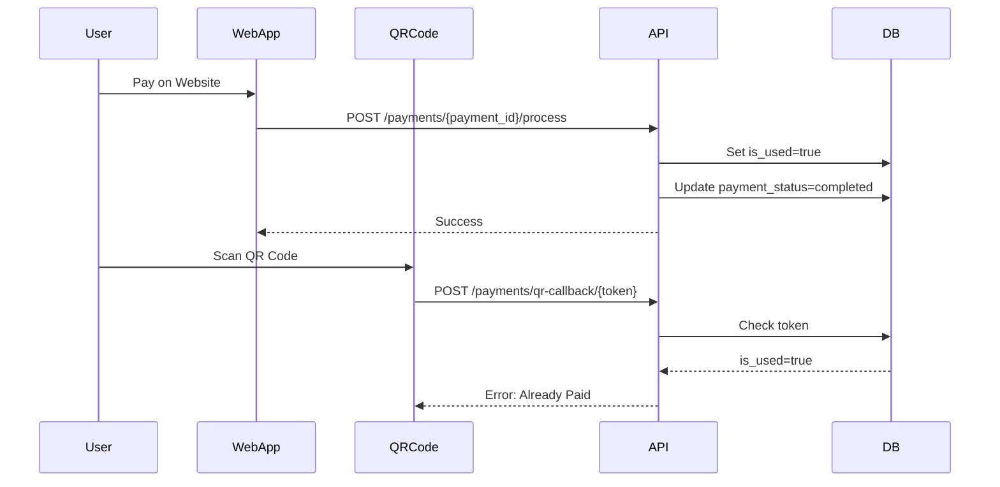
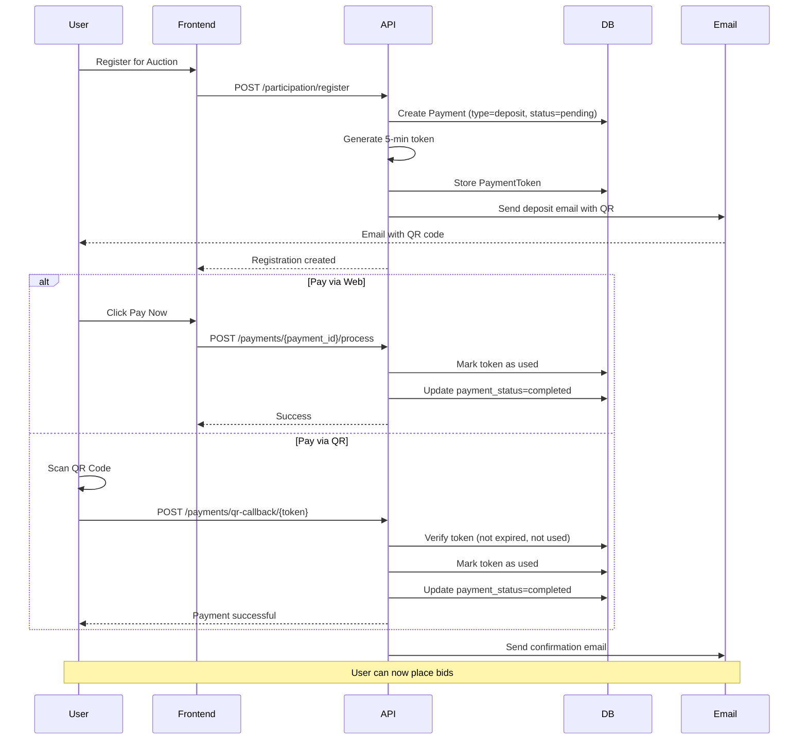
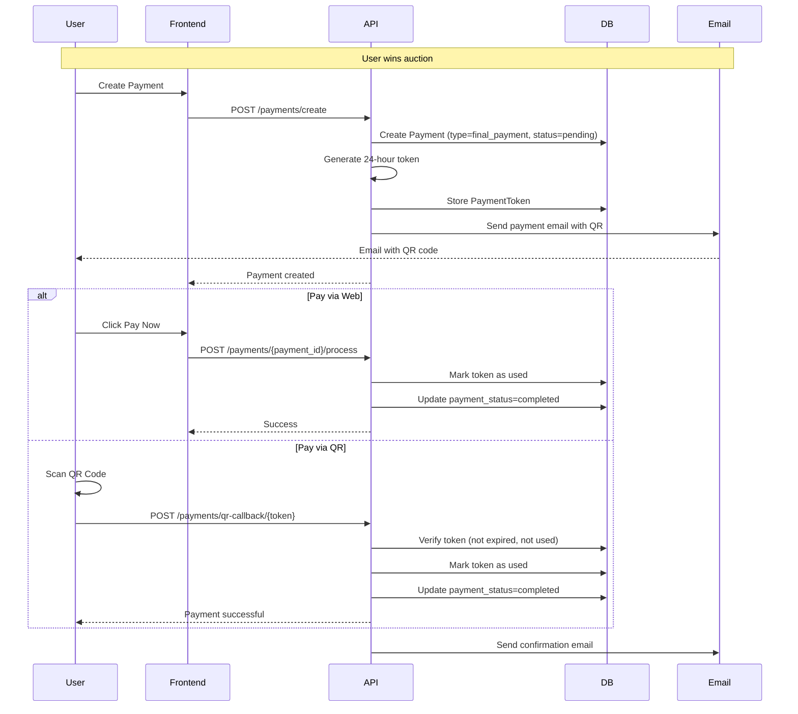
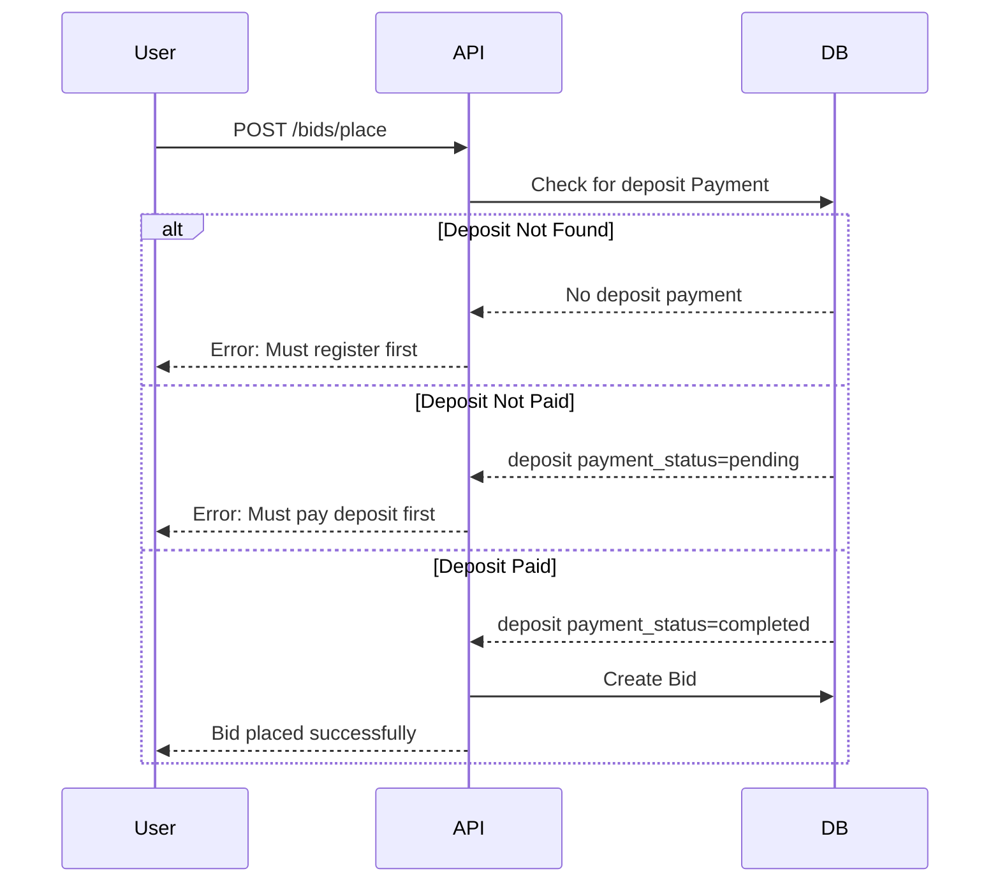

# Payment & QR System Architecture - SIMPLIFIED

## Overview
This document outlines the architecture for implementing deposit and final payment emails with QR code functionality, including token expiration management.

**Simplified Approach**: Reuse existing `Payment` model for both deposits and final payments instead of creating a separate `AuctionParticipation` model.

---

## Token Expiration Strategy

### Different Expiry Times
- **Deposit Token**: 5 minutes (fast registration requirement)
- **Final Payment Token**: 24 hours (flexible payment window)

### Token Lifecycle



### Preventing Double Payment

**Scenario**: User pays on web, then scans QR code

**Solution**:
1. Web payment endpoint marks token as `is_used=true` immediately
2. QR callback endpoint checks `is_used` flag before processing
3. If already used, return error: "Payment already completed"



---

## Database Schema

### PaymentToken Model (New)

```python
class PaymentToken(Base):
    __tablename__ = "payment_token"
    
    token_id: Mapped[int] = mapped_column(Integer, primary_key=True, autoincrement=True)
    token: Mapped[str] = mapped_column(String(512), unique=True, nullable=False, index=True)
    payment_id: Mapped[int] = mapped_column(ForeignKey("payment.payment_id"), nullable=False)
    user_id: Mapped[int] = mapped_column(ForeignKey("account.account_id"), nullable=False)
    amount: Mapped[int] = mapped_column(Integer, nullable=False)  # Amount in VND
    expires_at: Mapped[datetime] = mapped_column(DateTime, nullable=False)
    is_used: Mapped[bool] = mapped_column(Boolean, nullable=False, default=False)
    used_at: Mapped[Optional[datetime]] = mapped_column(DateTime)
    created_at: Mapped[datetime] = mapped_column(DateTime, nullable=False)
    
    payment: Mapped["Payment"] = relationship()
    user: Mapped["Account"] = relationship()
```

### Payment Model (Extended)

**New fields to add to existing Payment model:**

```python
class Payment(Base):
    __tablename__ = "payment"
    
    # Existing fields...
    payment_id: Mapped[int]
    auction_id: Mapped[int]
    user_id: Mapped[int]
    first_name: Mapped[Optional[str]]
    last_name: Mapped[Optional[str]]
    user_address: Mapped[Optional[str]]
    user_receiving_option: Mapped[Optional[str]]
    user_payment_method: Mapped[Optional[str]]
    payment_status: Mapped[Optional[str]]  # pending, completed, refunded
    
    # NEW FIELDS TO ADD:
    payment_type: Mapped[str] = mapped_column(String(50), nullable=False, default="final_payment")  # "deposit" or "final_payment"
    amount: Mapped[int] = mapped_column(Integer, nullable=False, default=0)  # Payment amount in VND
    created_at: Mapped[datetime] = mapped_column(DateTime, nullable=False)
    
    # Relationships
    auction: Mapped["Auction"] = relationship(back_populates="payments")
    user: Mapped["Account"] = relationship(back_populates="payments")
    tokens: Mapped[List["PaymentToken"]] = relationship(back_populates="payment")  # NEW
```

**Payment Types:**
- `deposit`: Auction registration deposit (typically 10x price_step)
- `final_payment`: Final payment for won auction

---

## QR Token Management (`app/utils/qr_token.py`)

### Functions

#### 1. `generate_payment_token()`
```python
def generate_payment_token(
    payment_id: int,
    user_id: int,
    amount: int,
    payment_type: str,  # "deposit" or "final_payment"
    db: Session
) -> tuple[str, datetime]:
    """
    Generate JWT token with appropriate expiry time
    
    Args:
        payment_id: ID from Payment table
        user_id: User account ID
        amount: Payment amount in VND
        payment_type: "deposit" or "final_payment"
        db: Database session
    
    Returns:
        tuple: (token_string, expires_at_datetime)
    """
    # Deposit: 5 minutes, Final Payment: 24 hours
    expiry_minutes = 5 if payment_type == "deposit" else 1440
    
    # Create JWT with exp claim
    # Store in PaymentToken table with is_used=False
    # Return token and expiry time
```

#### 2. `verify_payment_token()`
```python
def verify_payment_token(token: str, db: Session) -> dict:
    """
    Verify token validity
    
    Checks:
    - JWT signature valid
    - Token exists in database
    - Not expired (expires_at > now)
    - Not used (is_used == False)
    
    Returns:
        dict with token data (payment_id, user_id, amount, payment_type)
    
    Raises:
        HTTPException if invalid, expired, or already used
    """
```

#### 3. `invalidate_token()`
```python
def invalidate_token(token: str, db: Session) -> bool:
    """
    Mark token as used
    
    Sets:
    - is_used = True
    - used_at = current timestamp
    
    Returns:
        bool: True if successful
    """
```

#### 4. `generate_qr_url()`
```python
def generate_qr_url(token: str) -> str:
    """
    Generate mock payment URL
    
    Returns:
        URL like: http://localhost:8000/payments/qr-callback/{token}
    """
```

---

## Email Templates

### 1. Deposit Email (`send_deposit_email()`)

**Purpose**: Notify user to pay deposit for auction registration

**Key Elements**:
- Auction name and details
- Deposit amount
- QR code image/link
- **5-minute expiry warning** (prominent)
- Alternative web payment link
- Instructions

**Template Structure**:
```html
Subject: Thanh toán đặt cọc tham gia đấu giá - [Auction Name]

Body:
- Greeting with username
- Auction information
- Deposit amount in large text
- QR code section with 5-minute countdown warning
- Web payment button
- Warning: "Mã QR sẽ hết hạn sau 5 phút"
- Support contact
```

### 2. Final Payment Email (`send_payment_email()`)

**Purpose**: Request final payment for won auction

**Key Elements**:
- Congratulations message
- Auction details
- Final payment amount
- QR code image/link
- **24-hour expiry notice**
- Alternative web payment link
- Shipping/delivery information

**Template Structure**:
```html
Subject: Thanh toán đấu giá thành công - [Auction Name]

Body:
- Congratulations message
- Auction won details
- Payment amount in large text
- QR code section with 24-hour validity
- Web payment button
- Delivery address form reminder
- Warning: "Mã QR có hiệu lực trong 24 giờ"
- Support contact
```

### 3. Payment Confirmation Email (`send_payment_confirmation_email()`)

**Purpose**: Confirm successful payment

**Key Elements**:
- Payment confirmation
- Transaction details
- Next steps (shipping, etc.)
- Receipt information

---

## API Endpoints

### New Endpoints

| Method | Endpoint | Description | Auth |
|--------|----------|-------------|------|
| POST | `/payments/qr-callback/{token}` | Mock callback when QR scanned | No |
| GET | `/payments/token/{token}/status` | Check token validity | No |

### Updated Endpoints

| Method | Endpoint | Changes |
|--------|----------|---------|
| POST | `/participation/register` | Create deposit Payment record + send email |
| POST | `/bids/place` | Add deposit verification check |
| POST | `/payments/create` | Generate token + send payment email |
| POST | `/payments/{payment_id}/process` | Invalidate token when processing |

---

## Flow Diagrams

### Deposit Flow (Auction Registration) - SIMPLIFIED



### Final Payment Flow (Won Auction) - SIMPLIFIED



### Bid Placement with Deposit Check



---

## Configuration

### Environment Variables (.env)

```env
# QR Payment Token Settings
DEPOSIT_TOKEN_EXPIRE_MINUTES=5
PAYMENT_TOKEN_EXPIRE_HOURS=24
PAYMENT_CALLBACK_BASE_URL=http://localhost:8000/payments/qr-callback

# JWT Secret for Payment Tokens (separate from auth tokens)
SECRET_PAYMENT_TOKEN_KEY=your-payment-token-secret-change-this
```

---

## Security Considerations

1. **Separate JWT Secret**: Use different secret key for payment tokens vs auth tokens
2. **Token Uniqueness**: Ensure token strings are unique in database
3. **Rate Limiting**: Apply rate limiting to QR callback endpoint
4. **HTTPS Only**: In production, QR URLs must use HTTPS
5. **Token Invalidation**: Always check both expiry AND is_used flag
6. **Audit Trail**: Log all payment token usage attempts

---

## Testing Scenarios

### Test Cases

1. **Deposit Token Expiry**
   - Generate deposit token
   - Wait 6 minutes
   - Attempt to use token
   - Expected: "Token expired" error

2. **Double Payment Prevention**
   - Pay via web
   - Scan QR code
   - Expected: "Already paid" error

3. **Token Reuse Prevention**
   - Use token once successfully
   - Try to use same token again
   - Expected: "Token already used" error

4. **Concurrent Payment Attempts**
   - Scan QR and click web payment simultaneously
   - Expected: Only one succeeds, other gets "already used" error

---

## Implementation Order

1. **Database models** (PaymentToken + extend Payment model)
2. **QR token utility functions** (app/utils/qr_token.py)
3. **Email templates** (add to app/utils/mailer.py)
4. **Payment callback endpoint** (POST /payments/qr-callback/{token})
5. **Token status endpoint** (GET /payments/token/{token}/status)
6. **Update participation registration** (POST /participation/register)
7. **Update bid placement validation** (POST /bids/place)
8. **Update payment creation** (POST /payments/create)
9. **Configuration updates** (.env.example)
10. **Documentation updates** (API_ENDPOINTS_GUIDE.md)

---

## Key Differences from Original Plan

### Simplified Approach Benefits:
1. **No new table**: Reuse existing `Payment` table with `payment_type` field
2. **Unified payment flow**: Both deposits and final payments use same endpoints
3. **Simpler queries**: No need to join multiple tables
4. **Easier refunds**: Deposit refunds handled same as payment refunds

### Payment Type Distinction:
- `payment_type="deposit"`: Created during auction registration
- `payment_type="final_payment"`: Created after winning auction

### Status Flow:
```
Deposit: pending -> completed (or refunded if unregister)
Final Payment: pending -> completed
```

---

## Future Enhancements

1. Real QR code image generation (using qrcode library)
2. Integration with real payment gateway
3. Webhook support for payment notifications
4. SMS notifications for payment reminders
5. Payment retry mechanism
6. Partial payment support
7. Automatic deposit refund on auction cancellation
